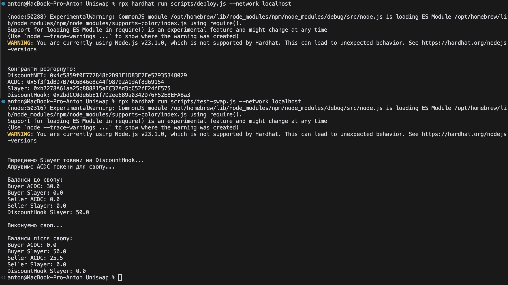

# Uniswap v4 Discount Hook

Проєкт демонструє реалізацію системи знижок для свопів з використанням NFT токенів.

## Огляд системи

Проект складається з чотирьох основних смарт-контрактів:

1. **DiscountNFT.sol** - ERC-721 токен, який містить метадані зі знижкою (0-20%)
2. **ACDC.sol** - ERC-20 токен для тестування свопів
3. **Slayer.sol** - ERC-20 токен для тестування свопів
4. **DiscountHook.sol** - Контракт для свопів з підтримкою знижок

## Функціональність

- Власники NFT отримують знижку на комісію при свопі
- Знижка зберігається в метадатах NFT
- Підтримується своп ACDC -> Slayer з фіксованим курсом (30 ACDC = 50 Slayer)
- Комісія розраховується з урахуванням знижки власника NFT

## Тестовий сценарій

1. Buyer отримує:
   - NFT зі знижкою 15%
   - 30 токенів ACDC

2. Seller отримує:
   - 50 токенів Slayer

3. Після свопу:
   - Buyer віддає 30 ACDC і отримує 50 Slayer
   - Seller отримує 25.5 ACDC (85% від 30 ACDC, застосована знижка 15%)

## Встановлення та тестування 

